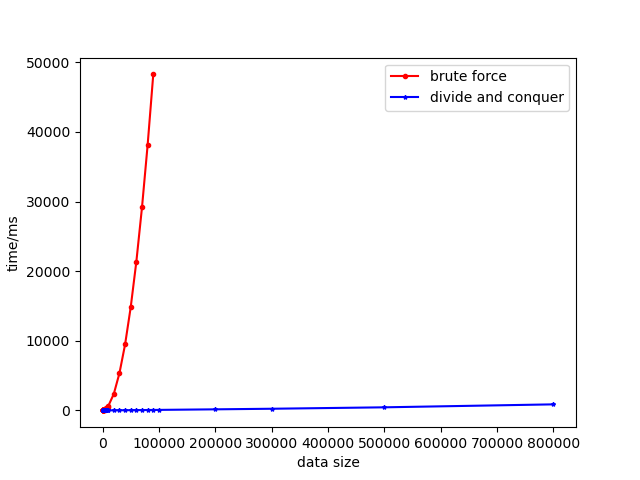
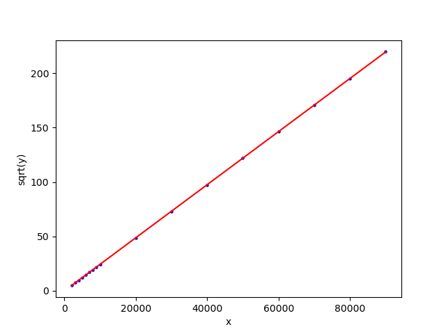
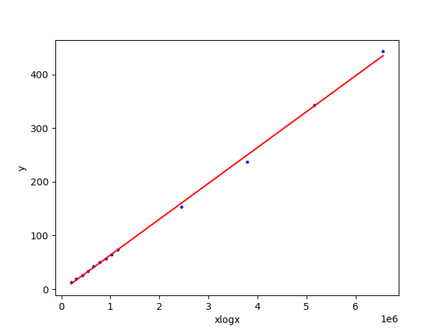
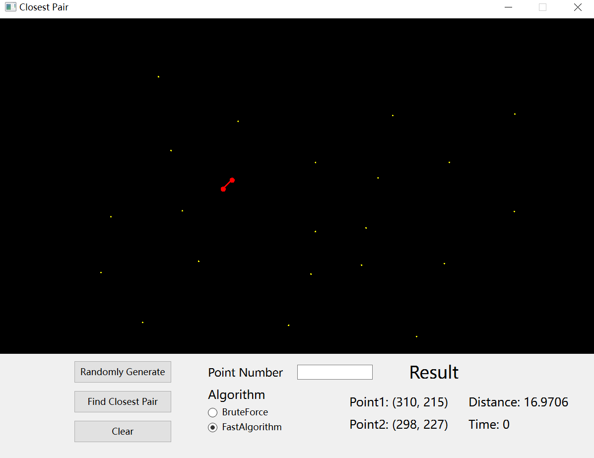

# Report on Closest Pair

## Background

The **closest pair of points problem** or **closest pair problem** is a problem of computational geometry: given $n$ points in matric space, find a pair of points with the smallest distance between them. The closest pair problem for points in the Euclidean plane was among the first geometric problems that were treated at the origins of the systematic study of the computational complexity of geometric algorithms. (Cite from [Wikipedia](https://en.wikipedia.org/wiki/Closest_pair_of_points_problem)) 

In this report, we implemented and compared two algorithms for closest pair problem. The first one is a brute-force approach with $\Theta(n^2)$ time complexity, while the other takes advantage of divide-and-conquer strategy, with $\Theta(n\log n)$ time complexity.

## Analysis of Complexity

### Brute Force

The brute force approach simply computes the distance of each pair of points, and returns the smallest distance. Since there are totally $\dbinom{n}{2}$ pair of points, the time complexity for this algorithm is $\Theta(n^2)$, which is not suitable for large-scale computation. The algorithm is also in-place, taking $O(1)$ auxiliary space.

### Divide-and-Conquer

The divide-and-conquer version tackles the problem more wisely. Find the middle point in the sorted array of points (based on x-axis) and divide the plane into two subspaces, then recursively find the smallest distances in both subarrays. Finally compute the smallest distance across the middle vertical line.

It can be proved that the last step can be completed in $\Theta(n)$ time. Therefore,
$$
T(n)=2T(n/2)+\Theta(n)
$$
which indicates that $T(n)=\Theta(n\log n)$.

Meanwhile, $\Theta(\log n)$ auxiliary space will be used for this algorithm, as implicit stack is created during recursive calls.

## Experiment

For these two algorithms, we conducted experiments on randomly generated data points of different sizes. Each experiment was repeated 10 times, and the average running time was taken as the time cost. The result is shown below.

> data size of the experiments
>
> * for brute-force method:
>
>   `10,20,30,40,50,60,70,80,90,100,200,300,400,500,600,800,900,1000,2000,3000,4000,5000,6000,7000,8000,9000,10000,20000,30000,40000,50000,60000,70000,80000,90000`
>
> * for divide-and-conquer method:
>
>   `10,20,30,40,50,60,70,80,90,100,200,300,400,500,600,800,900,1000,2000,3000,4000,5000,6000,7000,8000,9000,10000,20000,30000,40000,50000,60000,70000,80000,90000,100000,200000,300000,500000,800000`

The figure above illustrates the changes in the running time of two algorithms with different colors as the size of the data varies, and is fitted with a smooth curve. It can be seen from the figure that the time complexity of brute-force algorithm is much greater than that of divide-and-conquer one, which is in line with our understanding. Moreover, as the size of the data increases, the difference in time between the two algorithms becomes larger and larger (and becomes **extremely** large for brute-force method)

Next, we will verify whether the asymptotic complexity of the algorithms is consistent with theoretical analysis.

    

        
    

    

        
    

The two images above respectively show the linear fitting of two algorithms after coordinate transformation. We use $y$ to represent time cost, and $x$ to represent data size.

Due to the different expressions of the asymptotic complexity of the two algorithms, we used different methods for fitting: for the Brute-Force method, since $y\sim x^2$, we performed linear regression and line fitting on $\sqrt y$ over $x$; for the Divide-and-Conquer method, since $y\sim x\log x$, we performed line fitting on $y$ over $x\log x$.

It can be seen from the fitted images that the actual complexity of the algorithms is close to the theoretical complexity, i.e. $\text{time}=\Theta(n^2)$ for Brute-Force algorithm, while $\text{time}=\Theta(n\log n)$ for Divide-and-Conquer method, respectively.

## Appendix

There's a graphical interface for these two algorithms developed with `Qt`. We will show how to use it in this section.

This is a screenshot of the program interface. The top part is the drawing area, and each yellow dot corresponds to a two-dimensional coordinate. You can add new data points by left-clicking with the mouse.

The bottom part is the operation area. The `Randomly Generate` button is used to generate random data points. You can enter the number of points you want to generate in the `Point Number` textbox on the right (invalid input will be ignored). The `Find Closest Pair` button is the launcher for the algorithm, and you can choose different algorithms in the radio box under label `Algorithm`. The calculation result will be presented below the `Result` text on the right. `Point1` and `Point2` will display the coordinates of the closest pair of points, `Distance` represents the distance between them, and `Time` represents the algorithm's running time.

Additionally, these two points and the line connecting them will be highlighted in red in the graph. Besides, you can press `Clear` button to clear all points.

